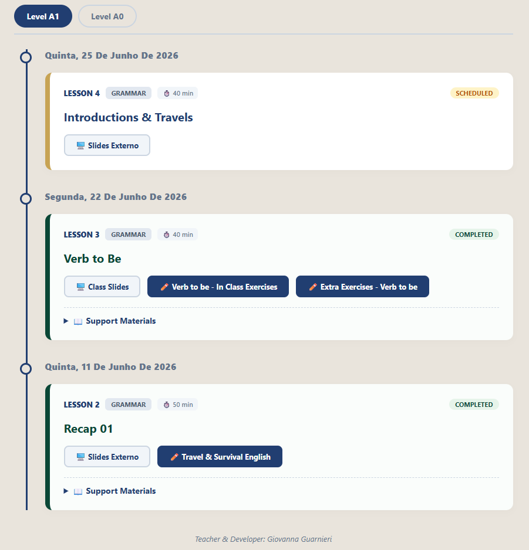
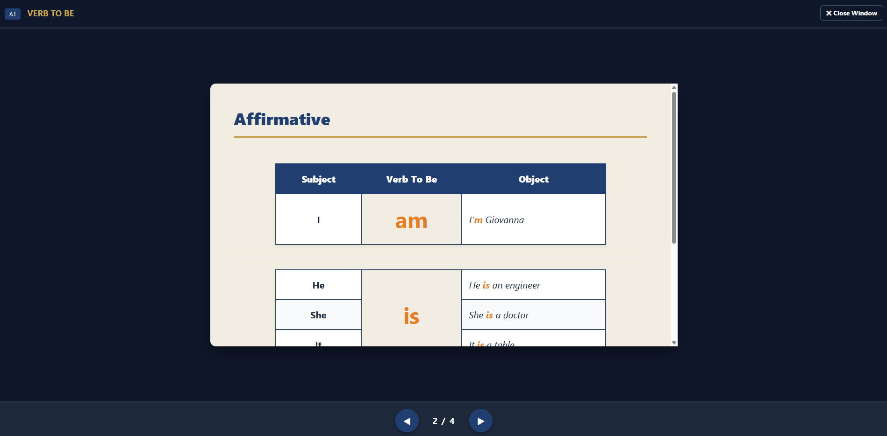
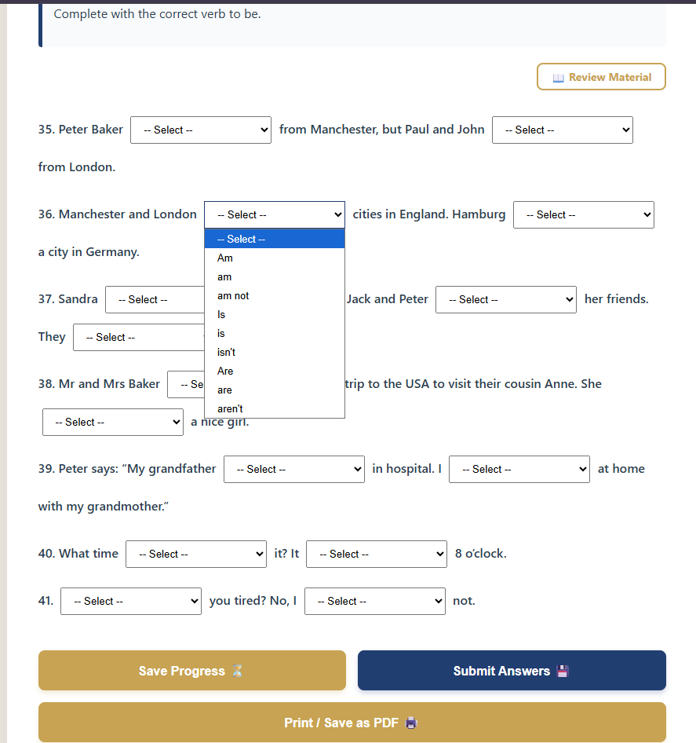
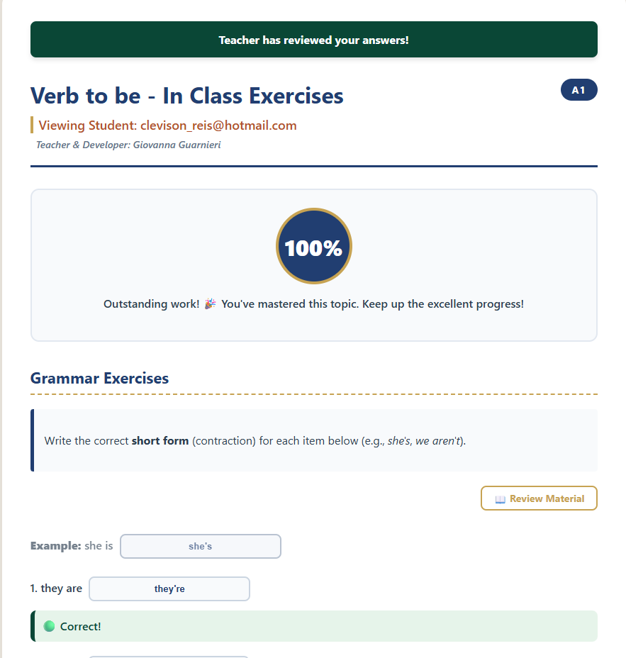
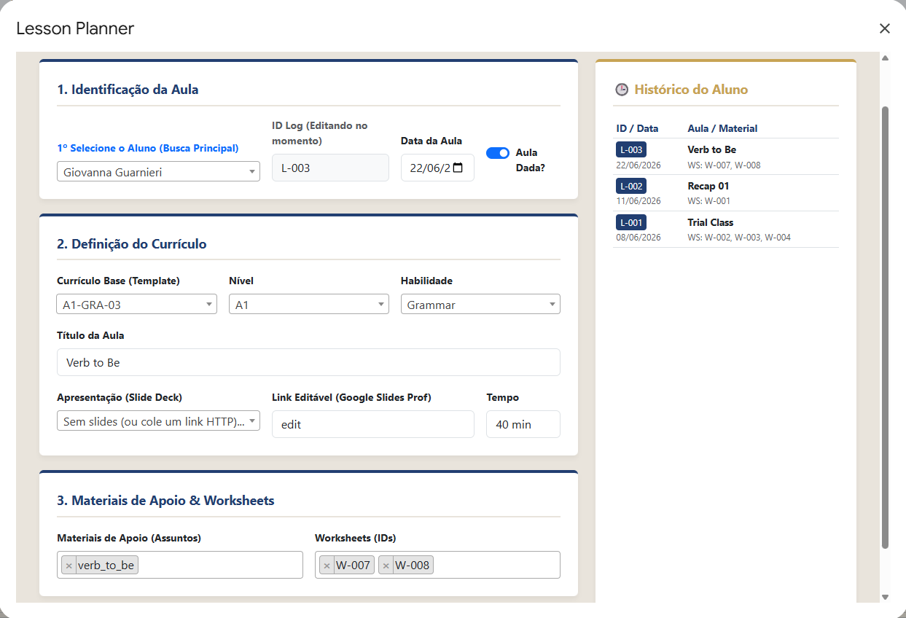
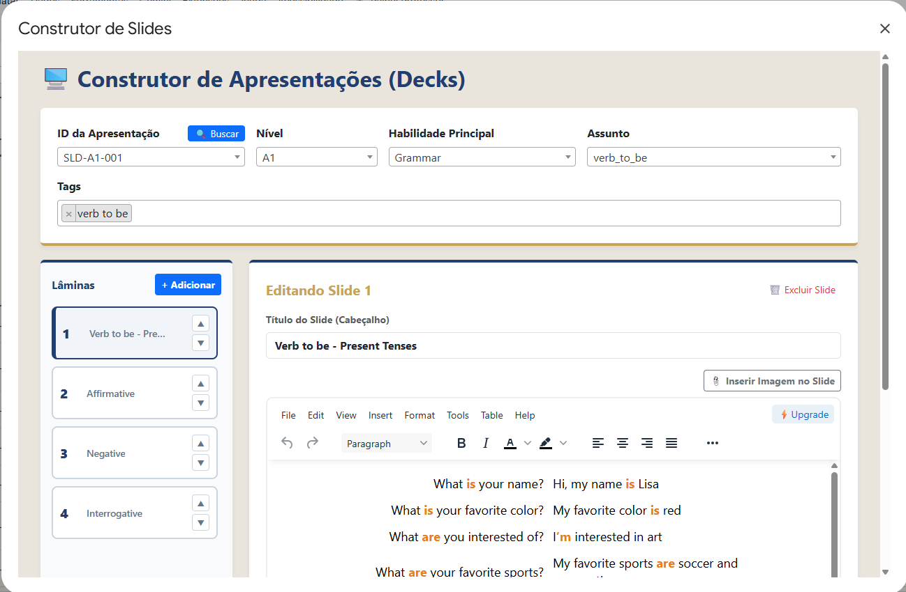
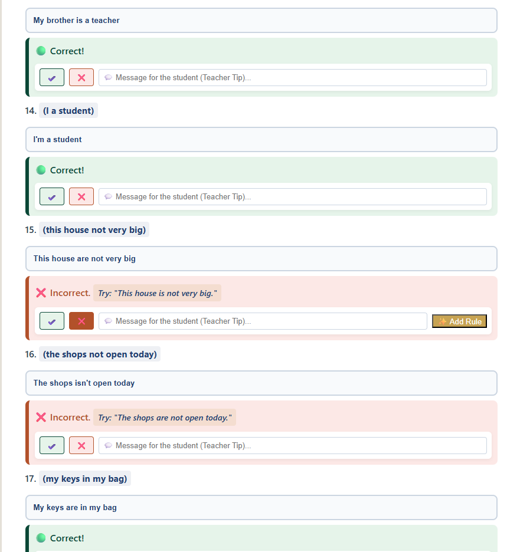
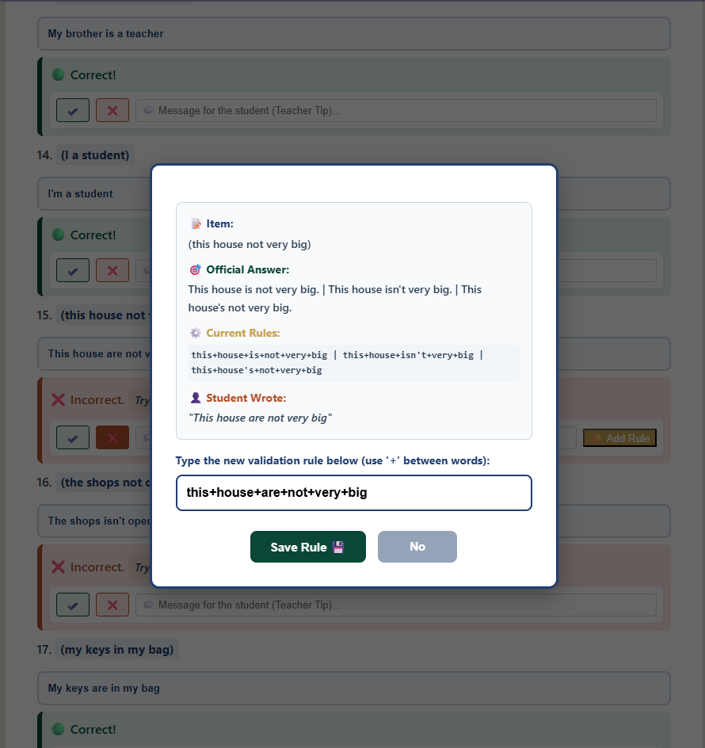

# 🚀 JavaScript Serverless LMS: Plataforma EdTech Full-Stack

**Status:** Em desenvolvimento | **Área:** EdTech (Educação & Tecnologia)

---

## 🎯 Contexto e Impacto (O Problema e a Solução)

A gestão de alunos particulares e turmas independentes geralmente exige múltiplas ferramentas pagas e fragmentadas (plataformas de exercícios, drives de materiais, agendadores de aula e planilhas de notas). 

Este projeto resolve esse problema unificando toda a jornada educacional. Trata-se de um **Learning Management System (LMS) Serverless** construído 100% no ecossistema Google Workspace. A plataforma elimina custos de hospedagem e centraliza o painel do aluno (Front-end) e a mesa de gestão da professora (CMS/Back-end) em uma única arquitetura inteligente e escalável.

---

## 💻 Tech Stack e Palavras-Chave

O desenvolvimento desta plataforma priorizou performance, componentização e ausência de frameworks pesados para garantir fluidez extrema (Vanilla Focus).

* **Front-end:** JavaScript (ES6+), HTML5, CSS3, Bootstrap 5, jQuery.
* **Back-end / API:** Google Apps Script (RESTful API via `doGet` e `doPost`).
* **Banco de Dados:** Google Sheets (NoSQL/Document-like approach).
* **Integrações Nativas:** Google Drive API (Upload e manipulação de arquivos em Base64).
* **Bibliotecas Externas:** TinyMCE (Rich Text Editor), Select2.
* **Padrões de Projeto (Design Patterns):** MVC, Factory Pattern (Renderização de interfaces camaleão), State Management.

---

## ⚙️ Arquitetura e Módulos do Sistema

A infraestrutura foi dividida em dois grandes ecossistemas que se comunicam via requisições assíncronas (`fetch`).

| Módulo | Tipo | Funcionalidade Principal |
| :--- | :--- | :--- |
| **Autenticação & Segurança** | Front/Back | Gateway de login, cadastro, recuperação de senha e encriptação (Hash SHA-256). |
| **Student Dashboard** | Front-end | Timeline interativa de aulas, acesso a slides nativos, notas e revisão de materiais. |
| **Motor de Worksheets** | Front-end | Renderização dinâmica de provas com validação algorítmica de respostas via Regex. |
| **Machine Learning Loop** | Back-end | Sistema de retroalimentação onde a professora adiciona regras de validação ao banco em tempo real. |
| **Lesson Planner CMS** | Back-end | Ferramenta administrativa para agendamento de aulas, atrelando slides e exercícios ao currículo. |
| **Construtor de Slides** | Back-end | Interface Master-Detail com TinyMCE para criação e armazenamento dinâmico de apresentações no banco. |

---

## 📸 Vitrine da Arquitetura e Telas do Sistema

### 1. Front-end: Student Experience (Ecossistema do Aluno)

A interface do aluno foi construída com foco em retenção, feedback instantâneo e design responsivo.

**Dashboard Híbrido e Timeline Dinâmica:**
*(Cruzamento em tempo real do histórico de aulas logadas com os níveis de proficiência do aluno).*

**Apresentações Nativas e Layout Engine:**
*(Leitura de banco de dados e conversão para visualização 16:9, eliminando a necessidade de envio de PDFs).*

**Motor Interativo de Worksheets e Scoreboard Inteligente:**
*(Renderização assíncrona (Factory Pattern) de inputs/dropdowns e sistema algorítmico de correção automática com injeção de feedback de incentivo).*

---

### 2. Back-end: Teacher CMS & Engenharia (Ecossistema Administrativo)

O grande diferencial da plataforma é o seu gerenciador de conteúdo proprietário, provando o domínio sobre CRUDs complexos, integração de APIs e manipulação de estado.

**Lesson Planner (Gestor de Relacionamentos):**
*(Ferramenta que atrela materiais, worksheets e apresentações ao ID do aluno, alimentando a timeline do Front-end em tempo real).*

**Construtor de Apresentações (Master-Detail UI):**
*(Interface integrada com TinyMCE e upload em Base64 para o Google Drive API, permitindo injeção de mídias direto no banco de dados).*

**Machine Learning Loop (Validação via Regex):**
*(Mesa de correção da professora com sistema de auditoria. Ao identificar uma resposta válida não mapeada, a professora adiciona uma ramificação (operador lógico `|`) alimentando a inteligência do validador estático).*

---

## 🔐 Direitos Autorais e Licença

© 2024. Todos os Direitos Reservados.
Este repositório atua exclusivamente como portfólio de arquitetura de software e design de interfaces. O uso, reprodução, cópia ou distribuição dos trechos de código aqui exibidos, sem autorização prévia, é estritamente proibido.
